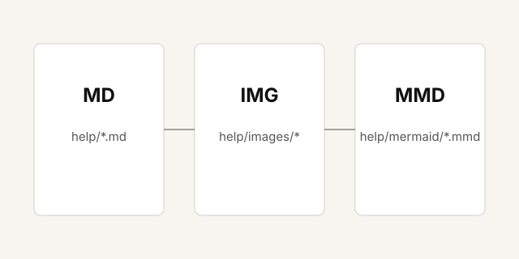

# Старт справки desengine

Это первая Markdown-страница справки. Она лежит в корневом каталоге `help/` и открывается по адресу `/help/start`.

## Assets

Картинки лежат внутри подкаталога `help/images`:

Mermaid-диаграммы можно держать отдельными `.mmd` файлами:

[Открыть схему справки](mermaid/help-flow)

